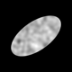

# cellgenerator

cellgenerator is a Python package for creating images that can be used as synthetic cells for _in silico_ experiments.

A cellgenerator image contains 3 major constituent parts:

1. A mask defining where the object is in the image
1. A stain object defining how the stain will change across the object
1. Noise to be added to the image.

These cells should be generated at a high resolution and can then be rotated, resized, viewed and saved.

```python
from cellgenerator import Image
from cellgenerator.mask import EllipseMask
from cellgenerator.stain import SpatialStain

# Generate an ellipse with given radii
em = EllipseMask(y_radius=200, x_radius=400)

# Simulate staining patterns within the ellipse
ss = SpatialStain(y_corr=20, x_corr=20)

# Set constants
img_dimensions = (80, 80)
img_rotation = 35
img_path = "example_images/spatial_stain_example.png"

# Create the simulated cell!
img = Image(dim=(1000, 1000), mask=em, stain=ss)

# Show what it looks like and rotate
img.plot(dim=img_dimensions, rotate=img_rotation)
img.save(path=img_path, dim=img_dimensions, rotate=img_rotation)
```

This will output the example cell:



## Installation

cellgenerator can be installed via pip.
If you would like to just use cellgenerator it can be downloaded straight from GitHub using:

```bash
pip install git+https://github.com/hwarden162/cellgenerator.git
```

or you can clone the repo yourself and install from your local copy

```bash
git clone git@github.com:hwarden162/cellgenerator.git
cd cellgenerator
pip install -e .
```

If you are wanting to develop cellgenerator you will want to install the dev dependencies too

```bash
git clone git@github.com:hwarden162/cellgenerator.git
cd cellgenerator
pip install -e '.[dev]'
```

You can also install cellgenerator using the `pyproject.toml` file through [poetry](https://python-poetry.org/docs/basic-usage/).

```bash
poetry install
```
